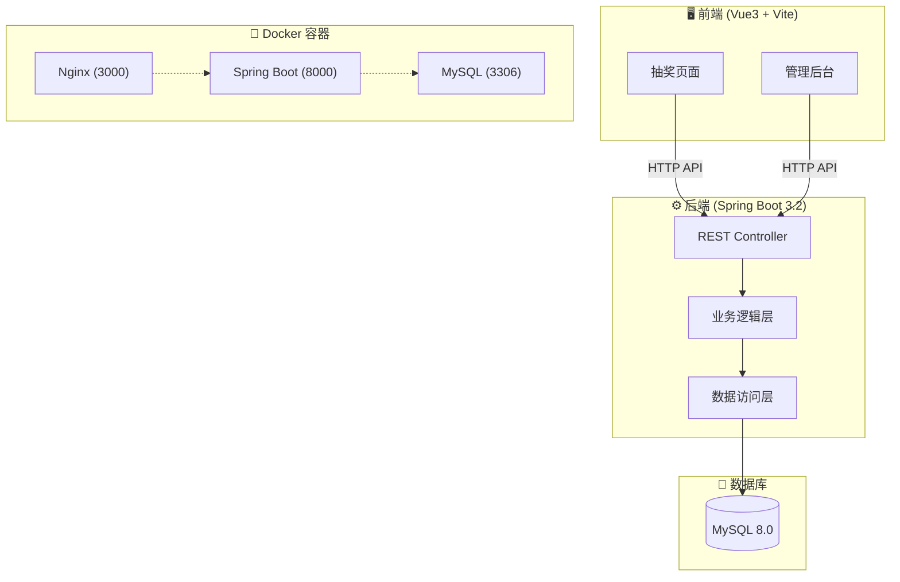
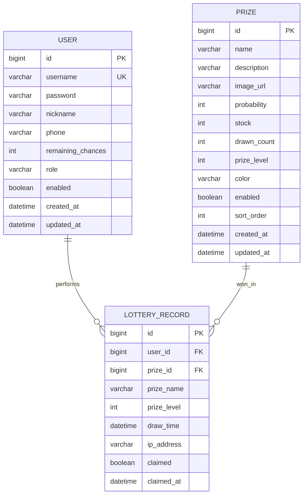

# 🎰 幸运大转盘 - 商业级抽奖系统

> **Slogan**: 公平、透明、高效的企业级在线抽奖解决方案

[](https://vuejs.org/)
[](https://spring.io/projects/spring-boot)
[](https://www.mysql.com/)
[](https://docs.docker.com/compose/)

---

## 📋 项目摘要

本项目是一个功能完整、视觉精美的**商业级抽奖系统**，采用前后端分离架构，支持多种抽奖模式（转盘抽奖、九宫格抽奖），提供完善的奖品管理、抽奖记录追踪和用户管理功能。

### 核心价值

| 特性 | 描述 |
|------|------|
| 🎯 **多样化抽奖模式** | 支持转盘、九宫格两种抽奖形式，精美动画效果 |
| 📊 **完善后台管理** | 奖品配置、概率设置、用户管理、记录查询 |
| 🔒 **公平透明** | 基于概率算法，可追溯的抽奖记录 |
| 🚀 **一键部署** | Docker Compose 快速启动，零本地依赖 |
| 🎨 **现代化UI** | 玻璃态设计、响应式布局、流畅动画 |

---

## 🏗️ 系统架构



---

## 💾 数据库设计



---

## 🛠️ 技术栈

| 层级 | 技术 | 版本 |
|------|------|------|
| **Frontend** | Vue 3 + Vite | 3.4+ / 5.0+ |
| **UI Framework** | Element Plus | 2.4+ |
| **State Management** | Pinia | 2.1+ |
| **Backend** | Spring Boot | 3.2+ |
| **ORM** | Spring Data JPA | 3.2+ |
| **Database** | MySQL | 8.0 |
| **API Doc** | Springdoc OpenAPI | 2.3+ |
| **Container** | Docker + Nginx | Latest |

---

## 🚀 快速启动 (Docker)

### 前置要求

- [Docker Desktop] 已安装并运行

### 一键启动

```bash
# 1. 进入项目根目录

# 2. 构建并启动所有服务
docker compose up --build

# 3. 等待服务就绪 (约1-2分钟)
```

### 访问地址

| 服务 | 地址 | 说明 |
|------|------|------|
| 🖥️ 前端页面 | http://localhost:3000 | 抽奖首页 |
| ⚙️ 后端API | http://localhost:8000 | REST API |
| 📄 API文档 | http://localhost:8000/swagger-ui.html | Swagger UI |

---

## 🧪 测试账号

| 角色 | 用户名 | 密码 | 权限 |
|------|--------|------|------|
| 管理员 | `admin` | `admin123` | 全部功能 + 后台管理 |
| 普通用户 | `user` | `user123` | 抽奖 + 查看记录 |

---

## 📁 项目结构

```
抽奖项目/
├── README.md                    # 项目说明文档
├── docker-compose.yml           # Docker 编排文件
│
├── backend/                     # 后端项目 (Spring Boot)
│   ├── Dockerfile
│   ├── pom.xml
│   └── src/main/java/com/lottery/
│       ├── LotteryApplication.java    # 应用入口
│       ├── config/                    # 配置类
│       ├── controller/                # REST 控制器
│       ├── entity/                    # JPA 实体
│       ├── repository/                # 数据访问层
│       ├── service/                   # 业务逻辑层
│       ├── dto/                       # 数据传输对象
│       └── exception/                 # 异常处理
│
└── frontend/                    # 前端项目 (Vue3)
    ├── Dockerfile
    ├── nginx.conf
    ├── package.json
    └── src/
        ├── main.js                    # 应用入口
        ├── api/                       # API 封装
        ├── components/                # 公共组件
        │   ├── LotteryWheel.vue       # 转盘组件
        │   └── LotteryGrid.vue        # 九宫格组件
        ├── views/                     # 页面视图
        │   ├── Home.vue               # 抽奖首页
        │   ├── Login.vue              # 登录页
        │   ├── Records.vue            # 记录页
        │   └── admin/                 # 管理后台
        ├── router/                    # 路由配置
        ├── stores/                    # Pinia 状态
        └── styles/                    # 全局样式
```

---

## 📷 功能介绍

### 🎡 抽奖首页
- 支持**转盘**和**九宫格**两种抽奖模式自由切换
- 精美的旋转动画和跑马灯效果
- 实时滚动显示最近中奖记录
- 显示剩余抽奖次数

### 🏆 奖品管理
- 奖品 CRUD 操作
- 可视化概率配置（千分比）
- 库存管理与状态控制
- 自定义奖品颜色

### 👥 用户管理
- 用户列表与分页
- 用户启用/禁用
- 增加抽奖次数

### 📊 记录管理
- 抽奖统计数据
- 最近中奖记录
- 奖品领取状态追踪

---

## 🔧 专业工程实践

### 1. 日志系统
- 使用 SLF4J + Logback 进行日志管理
- 支持控制台和文件两种输出方式
- 日志文件自动轮转（10MB/30天）

### 2. 错误处理
- 全局异常处理器 (`GlobalExceptionHandler`)
- 统一 API 响应格式 (`ApiResponse`)
- 业务异常与系统异常分离

### 3. 数据校验
- 实体层使用 Jakarta Validation 注解
- 控制器层参数校验
- 前端表单验证

### 4. 接口设计
- RESTful API 规范
- Springdoc OpenAPI 自动生成文档
- 统一响应格式与错误码

### 5. 生产级特性

| 特性 | 状态 | 说明 |
|------|:----:|------|
| 响应式布局 | ✅ | 支持 PC 和移动端 |
| 数据持久化 | ✅ | MySQL + Docker Volume |
| 健康检查 | ✅ | Actuator 端点 |
| CORS 配置 | ✅ | 支持跨域请求 |
| 日志系统 | ✅ | 文件 + 控制台 |
| 异常处理 | ✅ | 全局统一处理 |
| API 文档 | ✅ | Swagger UI |
| 容器化 | ✅ | Docker Compose |

---

## 🔄 开发轨迹

```
1. 数据库设计 → 2. 后端 API 开发 → 3. 前端组件开发 → 4. Docker 容器化
```

1. **数据库设计**: 设计 User、Prize、LotteryRecord 三表结构
2. **后端开发**: Spring Boot REST API + JPA 数据访问
3. **前端开发**: Vue3 组件化开发，Element Plus UI
4. **容器化**: Docker Compose 三服务编排

---

## ⚠️ 注意事项

1. 首次启动需要等待 MySQL 初始化完成（约30秒）
2. 默认端口：前端 3000，后端 8000，数据库 3306
3. 数据持久化在 Docker Volume 中，重启不丢失

---

## 📄 许可证

MIT License

---

<p align="center">
  Made with ❤️ for Lucky Draw
</p>
